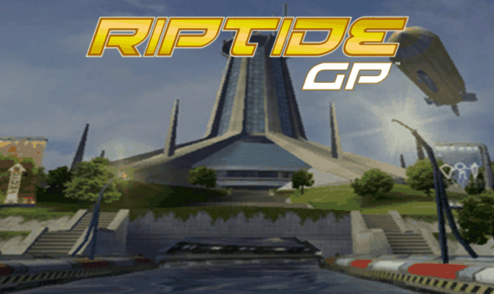

# Riptide GP — PS Vita port

<p align="center">
  
</p>

so-loader port of the Android version (1.6.3) of *Riptide GP* (Vector Unit).
It runs the original `libBlue.so` + `libfmodex.so` + `libfmodevent.so` with an emulated Java layer (FalsoJNI).
You need your own copy of the game APK; nothing from the game is distributed here.

> Status: menus and racing run on real hardware. See [`RELEASE.md`](RELEASE.md) and
> `port_progress.md`.

## Install

1. Install `kubridge.skprx` and `libshacccg.suprx` (ShaRKBR33D).
2. Install `riptidegp.vpk`.
3. Create `ux0:data/riptidegp/` and copy into it:
   - `libBlue.so`, `libfmodex.so` and `libfmodevent.so` from the APK's `lib/armeabi-v7a/` folder
   - `assets/Base.apf` from the APK's `assets/` folder (37 MB)
4. Launch. Logs go to `ux0:data/riptidegp/logs/`.

Alternative: stage the same layout under `ux0_data/riptidegp/` and run
`extras/scripts/upload_data.sh <vita-ip>` (add `--no-assets` to skip re-uploading `Base.apf`).

## Controls

| Vita | Action |
|---|---|
| Touch screen | Original touch controls |
| Left stick | Left analog axis (MOGA X/Y) |
| Right stick | Right analog axis (MOGA Z/RZ) |
| Cross / Circle / Square / Triangle | MOGA A / B / X / Y |
| L / L2 (PSTV/DS4) | MOGA L1 / L2 (left trigger axis mirrors them) |
| R / R2 | MOGA R1 / R2 (right trigger axis mirrors them) |
| L3 / R3 | MOGA thumb buttons |
| D-pad | MOGA D-pad |
| Select / Start | MOGA Select / Start |

Buttons and sticks are forwarded as MOGA gamepad events (`VuGamePadHelper`), the same
interface the Android version uses for external gamepads, so in-game meaning follows the
game's own gamepad mapping. In menus, use the touch screen.

## Options

`ux0:data/riptidegp/config.txt` exists, but there are no user-facing options yet (only
boilerplate placeholder keys). This section will grow once the game renders.

## Building

Requires VitaSDK. vitaGL is vendored in `vendor/vitaGL` (same tree as the Carnivores Vita
ports) and built automatically with `SOFTFP_ABI=1 NO_SPLASHSCREEN=1 NO_DEBUG=1 HAVE_SHADER_CACHE=1`.
Build and deploy with psvita-port-toolkit (`psvita-toolkit build`, `psvita-toolkit deploy --vpk`),
or plain CMake:

```sh
mkdir -p build && cd build && cmake .. -DCMAKE_POLICY_VERSION_MINIMUM=3.5 && make
```

Two gotchas this port depends on:

- The prebuilt `libvitaGL.a` from VitaSDK is not built with `SOFTFP_ABI=1`, and this loader is
  softfp (the Android `.so` requires it): with it the game runs with music on a permanently
  black screen. Hence the vendored vitaGL.
- The engine binds attribute locations right after `glCreateProgram()`, before any
  `glAttachShader()` (legal GLES2, bindings latch at link). vitaGL dereferences the program's
  vertex shader unconditionally and crashes on the `NULL`. `source/utils/glutil.c` queues those
  bindings and replays them inside `glLinkProgram`, where the shaders are already attached.

## Credits

Based on [soloader-boilerplate](https://github.com/v-atamanenko/soloader-boilerplate) (TheFloW, Rinnegatamante,
Volodymyr Atamanenko) and FalsoJNI. vitaGL by Rinnegatamante, kubridge by bythos.

## License

The loader is MIT-licensed (see [LICENSE](LICENSE)). The game, its assets and its `.so` files remain
the property of Vector Unit.
